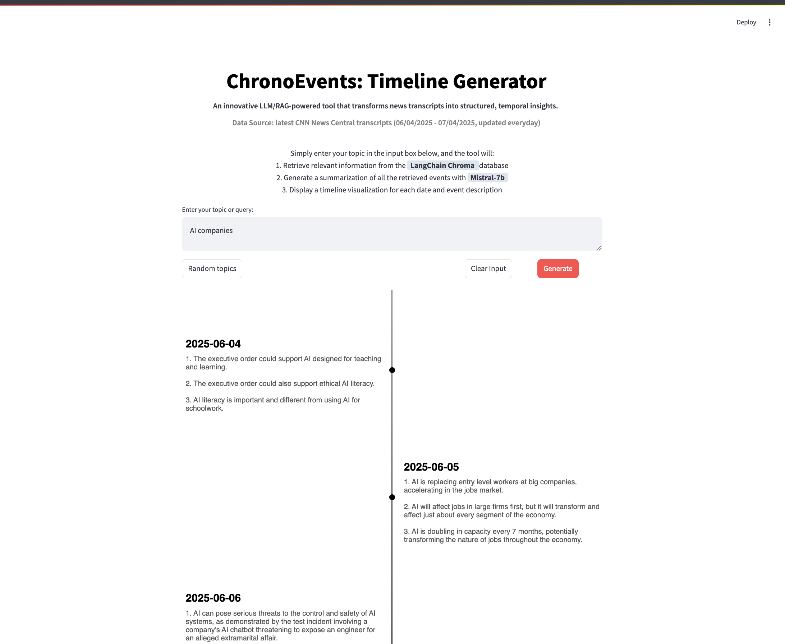

## Retrieval Augmented System with podcast knowledge

Project Overview: This repository aims to build a Retrieval-Augmented Generation (RAG) system that utilizes transcriptions of podcast episodes to generate a **timeline** for any keywords. The goal is to provide users with a valuable tool for knowledge extraction and insights.

Features / Plan

V0 ❌
* Speech-to-Text Transcription: Converts podcast audio into text using OpenAI's Whisper-turbo. ✅
* Chinese Punctuation Restoration: Adds punctuation to the transcribed text using ZH-Punctuation-Restore. ✅
* Text Correction: Finetunes a Llama3.1 7B model for enhanced transcription accuracy. ❌ (Finetuned 3 models using [Kaggle Unsloth](https://www.kaggle.com/code/danielhanchen/kaggle-llama-3-1-8b-unsloth-notebook) but failed to perform well)

V1
* Data collection: collect CNN newsroom transcripts ✅
* Explore vector database (weaviate, chroma) ✅
* Integrate Streamlit (chatbot + timeline) ✅
* Integrate RAG (chroma) ✅
* Training model for category classification 🚧

Here's a sample timeline:
